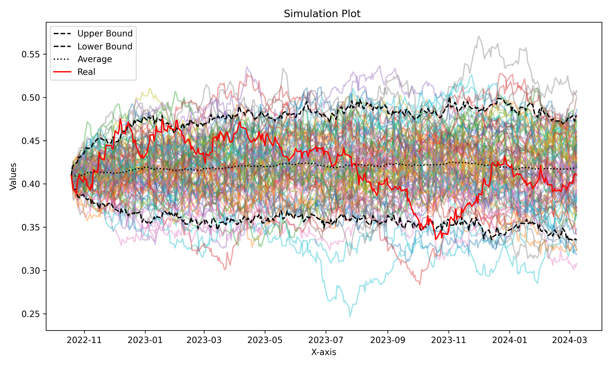

# Interest Rate Models
**Jan Miksa**

Flexible playground for instrument rate model simulations and visualizations. 📈

<p align="center"></p>

## Features
- Hydra-based configurability
- Multiprocessed chain sampling
- Bond Fit/Forecasting
- Yield Curve Fit

| Solver | Status |
| ------ | -- |
| Euler-Maruyama | ✅ |
| Milstein | ✅ |

| Model | Status |
| ----- | -- |
| Vasicek | ✅ |
| CIR | ❌ |
| RB | ❌ |
| Ho-Lee | ❌ |
| Hull-White | ❌ |
| BDT | ❌ |
| BK | ❌ |

## Commands
**Setup**
```
conda create -n "irm" python=3.11
pip install -r requirements.txt
cp example.env .env
edit .env
```

**Running**
```
conda acitvate irm
HYDRA_FULL_ERROR={0/1} python src/main.py --config-name config 
```

## Sources 
[Clint Howard 2017/08/19 Rates Simulations](https://clinthoward.github.io/portfolio/2017/08/19/Rates-Simulations/)  
[SOA Research 2023 Interest Rate Model Calibration Study](https://www.soa.org/48e9a7/globalassets/assets/files/resources/research-report/2023/interest-rate-model-calibration-study.pdf?fbclid=IwZXh0bgNhZW0CMTEAAR3zTE4etfOMoBwN2UMn9SoC6v7GDwu-cV_ofJWsRjuGBa9LJa1RYXOTELc_aem_6IgV8rL0D7SaQ-OnH7xb3w)